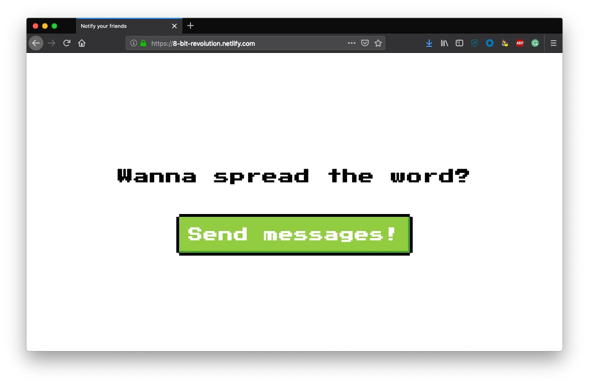
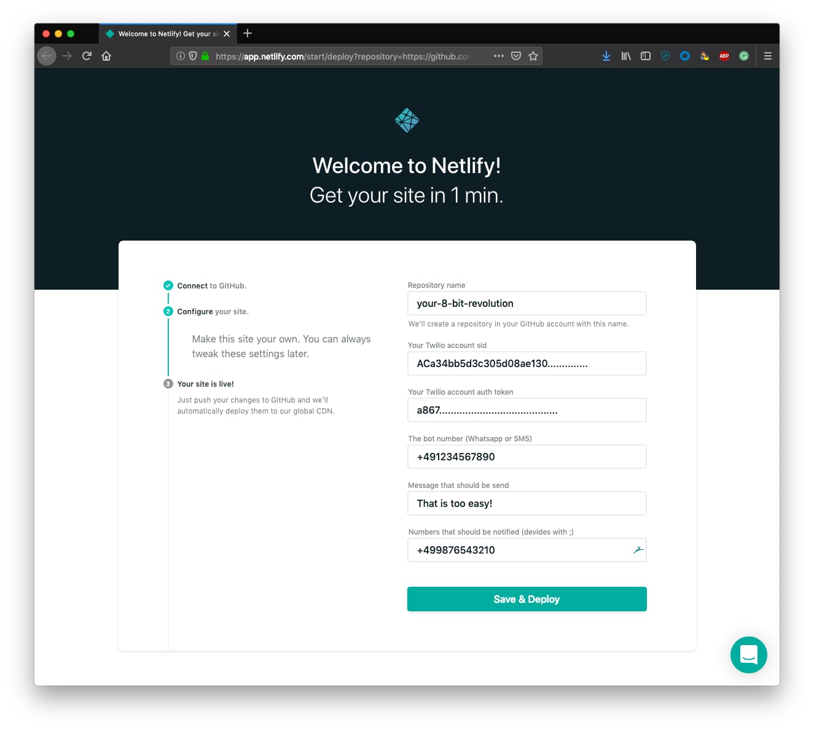

# 8-bit-revolution

> aka "How to send text messages from your static site using [Netlify](https://www.netlify.com/), [Twilio](https://www.twilio.com/) and serverless functions

Tell your friends how much you like 8-bit via text (SMS or WhatsApp)... every day! As much as you want!

## How does this work?

Using serverless functions you can build all the HTTP endpoints you need to power your static sites (finally!!!). This example site uses Netlify Lambda functions to send messages to all of your friends using the Twilio API. Thanks to the usage of serverless functions your authorization token won't be exposed and it's save to use Twilio.

## Setup

To set this project up yourself you can hit the button (👆) which leads you to a one-click install solution. What you need is a Twilio account and the numbers of your friends.

<dl>
  <dt>Repository name</dt>
  <dd>Given name of the new repository which will be created in your GitHub account e.g. <code>my-8-bit-revolution</code></dd>

  <dt>Twilio Account SID</dt>
  <dd>You'll find your account sid in <a href="https://www.twilio.com/console">your Twilio console</a> e.g. <code>AC...................</code></dd>

  <dt>Twilio auth token</dt>
  <dd>You'll find your auth token in <a href="https://www.twilio.com/console">your Twilio console</a> e.g. <code>a8...................</code> 
  (make sure to treat your auth token safe and secure – <a href="https://www.twilio.com/blog/protect-phishing-auth-token-fraud">this article</a> gives guidance)</dd>

  <dt>Bot number</dt>
  <dd>The number you bought on Twilio. This will be the number that will send messages e.g. <code>+4911111111111</code></dd>

  <dt>Message</dt>
  <dd>The message you want to spread and send your friends e.g. <code>8-bit rocks</code></dd>

  <dt>The numbers that should receive the message</dt>
  <dd>A semi-colon seperated list of phone numbers e.g. <code>+491234567890;+490987654321</code></dd>
</dl>

## What did just happen?

By doing the one-click installation dialog on Netlify you created your own copy of [8-bit-revolution.netlify.com](https://8-bit-revolution.netlify.com).

The process created a new GitHub project in your GitHub account. This project includes all the source code to send SMS from a static site. You can now start and tweak the styles and functionality if you'd like to.

Additionally it set up a webhook connection to redeploy the site every time you push code to the GitHub repository. Magic. 👌

## Learn more

You can find out more on how this is done by reading [the tutorial on twilio.com](https://www.twilio.com/blog/a-how-to-send-text-messages-from-your-static-site-using-netlify-twilio-and-serverless-functions).
